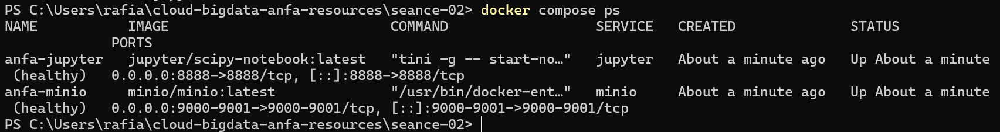

# Rendu - Séance 2

**Nom et prénom :** KAMBIA Rafiatou
**Identifiant GitHub :** rafiatou-collab

## Résumé de la séance

J'ai écrit un Dockerfile pour conteneuriser un script PySpark analysant le référentiel Anfa, construit et exécuté l'image `anfa-analyse:v1`, appliqué les bonnes pratiques Docker (`.dockerignore`, optimisation du cache), orchestré un stack à 3 services (MinIO, Jupyter, anfa-app) avec Docker Compose, et exploré les données MinIO depuis un notebook Jupyter via boto3 et pandas.

## Étapes principales

1. Écriture du Dockerfile et construction de l'image `anfa-analyse:v1` (taille observée : ~1.2 Go).
2. Mise en place du `.dockerignore` et observation du cache Docker : toutes les couches sont en CACHED lors d'un rebuild sans modification.
3. Écriture du `docker-compose.yml` orchestrant MinIO (stockage S3), Jupyter (exploration) et anfa-app (analyse PySpark).
4. Création du notebook `exploration_minio.ipynb` lisant les CSV depuis MinIO via boto3 et pandas.

## Captures d'écran

### docker compose ps


### Notebook Jupyter


## Bonus multi-stage (optionnel)

Non réalisé.

## Réponses aux exercices d'application

### Exercice 1 : QCM conceptuel

**1.1 → C** : Un conteneur partage le noyau de la machine hôte, contrairement à une VM qui embarque son propre noyau.

**1.2 → B** : L'image est un modèle figé en lecture seule ; le conteneur est une instance en cours d'exécution de cette image.

**1.3 → B** : Docker utilise les namespaces Linux pour donner à chaque conteneur une vue isolée du système (réseau, fichiers, processus).

**1.4 → A** : Docker utilise les cgroups pour limiter et surveiller les ressources (CPU, mémoire) consommées par chaque conteneur.

**1.5 → B** : Sous macOS, Docker Desktop lance en arrière-plan une machine virtuelle Linux légère dans laquelle tournent les conteneurs.

**1.6 → B** : DotCloud était la startup fondée par Solomon Hykes qui a créé Docker et l'a open-sourcé en 2013.

**1.7 → C** : Docker n'a pas inventé les namespaces ni les cgroups, mais a apporté un format d'image portable, une CLI simple et un registre public (Docker Hub).

**1.8 → B** : OCI signifie Open Container Initiative, une norme ouverte définissant les spécifications pour les formats d'image et les runtimes de conteneurs.

### Exercice 2 : Lecture et analyse d'un Dockerfile

**2.1 Explication de chaque instruction :**
- `FROM python:3.11` : définit l'image de base à partir de laquelle on construit notre image.
- `WORKDIR /application` : définit `/application` comme répertoire de travail courant dans le conteneur.
- `COPY . /application` : copie tout le contenu du dossier local dans `/application` du conteneur.
- `RUN pip install -r requirements.txt` : installe les dépendances Python listées dans `requirements.txt`.
- `EXPOSE 5000` : documente que le conteneur écoute sur le port 5000 (déclaratif seulement).
- `CMD ["python", "main.py"]` : définit la commande exécutée au démarrage du conteneur.

**2.2 Différence entre `EXPOSE 5000` et `-p 5000:5000` :**
`EXPOSE 5000` est purement déclaratif, il n'ouvre aucun port sur la machine hôte. `-p 5000:5000` dans `docker run` publie réellement le port du conteneur sur la machine hôte, le rendant accessible depuis l'extérieur.

**2.3 Deux problèmes :**

Problème 1 — Mauvais ordre des instructions : `COPY . .` est fait avant `RUN pip install`, donc toute modification du code invalide le cache et force un `pip install` complet à chaque rebuild. Correction : copier d'abord uniquement `requirements.txt`, installer les dépendances, puis copier le reste du code.

Problème 2 — Image de base trop lourde : `python:3.11` embarque des outils de compilation inutiles en production. Correction : utiliser `python:3.11-slim`.

**2.4 Version corrigée :**

```dockerfile
FROM python:3.11-slim

ENV PYTHONDONTWRITEBYTECODE=1
ENV PYTHONUNBUFFERED=1

WORKDIR /application

COPY requirements.txt .
RUN pip install --no-cache-dir -r requirements.txt

COPY . .

RUN adduser --disabled-password --gecos "" appuser
USER appuser

EXPOSE 5000
CMD ["python", "main.py"]
```

### Exercice 3 : Diagnostic

**3.1 Le build qui échoue**

a. `RUN pip install -r requirements.txt` est exécuté avant `COPY . .`, donc `requirements.txt` n'existe pas encore dans le conteneur.

b. Correction :
```dockerfile
FROM python:3.11-slim
WORKDIR /app
COPY requirements.txt .
RUN pip install -r requirements.txt
COPY . .
CMD ["python", "main.py"]
```

c. Les instructions `RUN` s'exécutent dans le système de fichiers du conteneur, pas sur la machine hôte — un fichier n'existe dans le conteneur que s'il y a été explicitement copié via `COPY` avant d'être utilisé.

**3.2 Le conteneur qui ne voit pas l'autre**

a. `localhost` désigne le conteneur lui-même, pas le conteneur `db`.

b. Correction : remplacer `localhost` par le nom du service `db` :


### Exercice 4 : Optimisation d'image

a. Quatre problèmes :

1. Image de base trop lourde (`ubuntu:22.04`) : embarque des centaines d'outils inutiles ; utiliser `python:3.11-slim` réduirait drastiquement la taille.
2. Plusieurs `RUN apt-get` séparés : chaque `RUN` crée une couche Docker inutile ; les combiner avec `&&` réduit le nombre de couches.
3. Outils inutiles installés (`curl`, `wget`, `git`, `build-essential`) : non nécessaires à l'exécution, ils gonflent l'image et augmentent la surface d'attaque.
4. Absence de nettoyage du cache apt : sans `rm -rf /var/lib/apt/lists/*`, le cache des paquets reste dans l'image et l'alourdit inutilement.

### Exercice 5 : Mini-cas d'architecture

**a. Services à conteneuriser :**
- `minio` : stockage objet S3 qui reçoit les résultats agrégés et les expose à Jupyter.
- `pipeline` : script Python qui lit le FTP, nettoie les données et écrit dans MinIO.
- `jupyter` : notebook pour l'exploration et la visualisation des données dans MinIO.

**b. Restart policy :**
`on-failure` : le script est un batch qui s'arrête normalement après exécution (exit 0) ; `on-failure` garantit qu'il redémarre uniquement en cas d'erreur, sans tourner en boucle inutilement.

**c. Passer la date au script :**
- Mécanisme 1 : variable d'environnement via `environment: DATE: "2026-06-22"` dans le Compose.
- Mécanisme 2 : argument via `command: ["python", "pipeline.py", "--date", "2026-06-22"]`.
Recommandation : la variable d'environnement, plus flexible et compatible avec les outils d'orchestration.

**d. Pourquoi ne pas mettre le script dans Jupyter ?**
Mélanger le pipeline et Jupyter viole le principe de responsabilité unique : un conteneur = un rôle. Cela rendrait l'image plus lourde, les logs mélangés, et un redémarrage en cas d'erreur du pipeline affecterait aussi Jupyter.

**e. Squelette docker-compose.yml :**

```yaml
services:
  minio:
    image: minio/minio:latest
    environment:
      MINIO_ROOT_USER: anfa-admin
      MINIO_ROOT_PASSWORD: anfa-password
    volumes:
      - minio-data:/data
    command: server /data --console-address ":9001"
    healthcheck:
      test: ["CMD", "curl", "-f", "http://localhost:9000/minio/health/live"]
      interval: 10s
      retries: 5

  pipeline:
    build: ./pipeline
    environment:
      DATE: "2026-06-22"
      MINIO_ENDPOINT: "http://minio:9000"
    restart: on-failure
    depends_on:
      minio:
        condition: service_healthy

  jupyter:
    image: jupyter/scipy-notebook:latest
    ports:
      - "8888:8888"
    environment:
      JUPYTER_TOKEN: anfa-token
    volumes:
      - ./notebooks:/home/jovyan/work
    depends_on:
      minio:
        condition: service_healthy

volumes:
  minio-data:
```

## Difficultés rencontrées

- `apt-get install openjdk-17-jre-headless` échouait avec exit code 100 (problème réseau). Contournement : utilisation de l'image `eclipse-temurin:17-jre-jammy` qui embarque déjà Java 17.
- Conflit sur le conteneur `anfa-minio` existant depuis la séance 1. Résolution : `docker rm -f anfa-minio`.
- Volume MinIO recréé : bucket et clé applicative recréés via `mc` avant de relancer l'upload.
