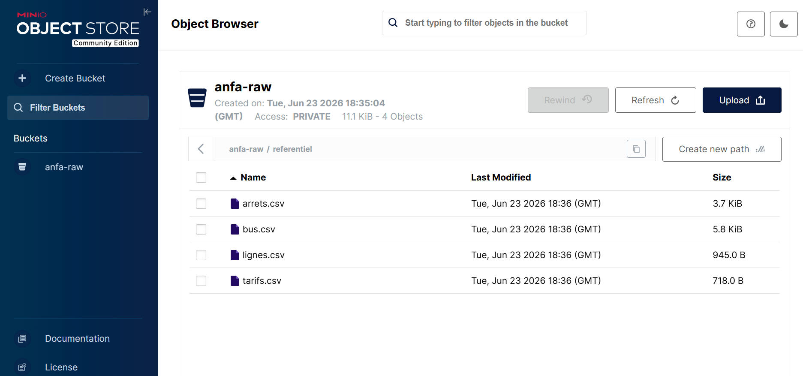
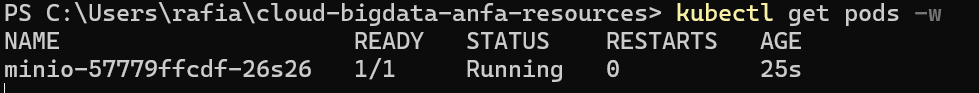
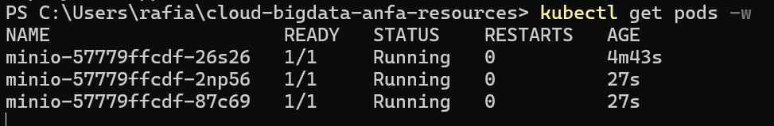

# Rendu Séance 3

**Nom et prénom :** KAMBIA Rafiatou
**Identifiant GitHub :** rafiatou-collab

## Résumé de la séance

J'ai installé Kind et kubectl, créé un cluster Kubernetes local nommé "anfa", configuré le namespace anfa, déployé MinIO via 3 manifestes YAML (PVC, Deployment, Service), observé le self-healing après suppression manuelle d'un pod, testé le scaling de 1 à 3 replicas, et activé l'Ingress Controller nginx.

## Étapes principales

1. Installation de Kind et kubectl, création du cluster `anfa`.
2. Création du namespace `anfa` et configuration de kubectl.
3. Déploiement de MinIO via 3 manifestes YAML (PVC, Deployment, Service).
4. Observation du self-healing après suppression manuelle d'un pod.
5. Scaling du Deployment de 1 à 3 replicas, puis retour à 1.
6. Activation de l'Ingress Controller nginx.

## Captures d'écran

### Console MinIO accessible via port-forward


### Self-healing observé


### Scaling à 3 replicas


## Réponses aux exercices d'application

### Exercice 1 : QCM conceptuel

**1.1 -> B** : Kubernetes orchestre des conteneurs sur un cluster de machines en s'appuyant sur un container runtime (containerd, Docker, CRI-O), il ne remplace pas Docker.

**1.2 -> B** : etcd est la base de données clé-valeur distribuée qui stocke l'état complet du cluster Kubernetes.

**1.3 -> C** : Le Scheduler décide sur quel noeud placer un nouveau pod en fonction des ressources disponibles et des contraintes définies.

**1.4 -> C** : kubectl parle à l'API Server, qui est le point d'entrée unique et central de toutes les opérations sur le cluster.

**1.5 -> B** : Le Deployment recrée immédiatement un nouveau pod pour revenir à l'état souhaité (1 replica) - c'est le self-healing observé en TP.

**1.6 -> B** : NodePort expose le service sur un port de chaque noeud du cluster, accessible depuis l'extérieur sans load balancer cloud.

**1.7 -> B** : La commande modifie l'état souhaité du Deployment à 5 replicas ; Kubernetes converge automatiquement vers ce nombre en créant ou supprimant des pods.

**1.8 -> B** : Un Namespace isole logiquement les ressources du cluster, permettant de séparer les environnements ou les équipes.

**1.9 -> B** : Avec Kind, les noeuds Kubernetes sont en réalité des conteneurs Docker basés sur l'image kindest/node, comme observé avec docker ps en TP.

### Exercice 2 : Lecture et interprétation d'un manifeste

**2.1** : selector.matchLabels indique au Deployment quels pods il doit gérer en filtrant par label ; il doit correspondre exactement à template.metadata.labels pour que le Deployment puisse identifier et contrôler les pods qu'il crée.

**2.2** : 2 pods seront créés (replicas: 2) ; si l'un meurt, le Deployment détecte que l'état observé (1 pod) diffère de l'état souhaité (2 pods) et en recrée un automatiquement - c'est le self-healing.

**2.3** : minio est le nom du Service Kubernetes qui expose MinIO ; la résolution DNS est assurée par CoreDNS, qui tourne dans le cluster et traduit automatiquement le nom de service en adresse IP interne - les IPs de pods étant éphémères, le nom de service est stable.

**2.4** : Sans Service, l'API est inaccessible depuis l'extérieur du cluster et depuis les autres pods - elle n'a pas d'adresse réseau stable, donc aucun client ne peut la joindre.

**2.5** :
```yaml
apiVersion: v1
kind: Service
metadata:
  name: anfa-api
  namespace: anfa
spec:
  type: ClusterIP
  selector:
    app: anfa-api
  ports:
  - port: 80
    targetPort: 8000
```

### Exercice 3 : Diagnostic

**3.1 - Le pod qui ne démarre pas**

a. ImagePullBackOff signifie que Kubernetes n'arrive pas à télécharger l'image du conteneur depuis le registre ; après plusieurs échecs, il attend de plus en plus longtemps avant de réessayer.

b. Le nom de l'image est mal orthographié : minio/miniooo:latest n'existe pas dans Docker Hub - il y a trois o au lieu de deux.

c. kubectl describe pod minio-7d9f8b6c5-x2k9p

**3.2 - Le PVC qui ne se lie pas**

a. Pending signifie que Kubernetes n'a pas encore trouvé de PersistentVolume capable de satisfaire la demande ; le PVC attend qu'un volume disponible corresponde à ses critères.

b. Demander 500Gi dépasse très probablement la capacité disponible sur le disque local de la machine Kind.

c. kubectl describe pvc data-pvc

**3.3 - Le port-forward qui échoue**

a. kubectl port-forward ne peut rediriger le trafic que vers un pod en état Running ; si le pod est en Pending, aucun processus n'écoute encore sur les ports.

b. kubectl describe pod <nom-du-pod>

c. 1. Vérifier que le pod est Running avec kubectl get pods. 2. Vérifier que le Service existe avec kubectl get service. 3. Lancer kubectl port-forward seulement quand le pod est Running.

### Exercice 4 : De Docker Compose à Kubernetes

**4.1** : 3 manifestes distincts sont nécessaires : minio-pvc.yaml (stockage persistant), minio-deployment.yaml (description du pod et de son cycle de vie), minio-service.yaml (exposition réseau stable).

**4.2** : Un volume Docker nommé est géré localement par le daemon Docker sur une seule machine, sans notion de capacité ni de classe de stockage. Un PVC Kubernetes est une demande formelle de stockage adressée au cluster qui spécifie une capacité, un mode d'accès et une StorageClass - Kubernetes se charge de trouver ou provisionner le volume correspondant indépendamment de la machine physique.

**4.3** : En Docker Compose, les ports publiés sont directement mappés sur l'hôte (localhost:9001). Avec Kind, les noeuds sont eux-mêmes des conteneurs Docker - le NodePort est exposé sur le conteneur Kind, pas sur l'hôte. kubectl port-forward crée un tunnel entre l'hôte et le pod. Pour un accès direct comme Compose, il faudrait configurer Kind avec extraPortMappings.

**4.4** : Self-healing - après suppression manuelle du pod MinIO, Kubernetes en a recréé un automatiquement sans intervention, impossible avec Docker Compose. Scaling déclaratif - une seule commande kubectl scale a suffi pour passer à 3 replicas, alors qu'avec Compose il faudrait reconfigurer et relancer manuellement.

### Exercice 5 : Mini-cas d'architecture

**5.1** :
- pipeline-anfa -> CronJob : la tâche tourne chaque nuit à 2h du matin de manière planifiée et se termine après 15 minutes.
- anfa-api -> Deployment : l'API doit être toujours disponible, sans état persistant, et nécessite un scaling dynamique.
- anfa-dashboard -> Deployment : Grafana est une application web sans état qui tourne en continu avec une disponibilité standard.

**5.2** : minReplicas: 2 pour garantir la haute disponibilité en période creuse, maxReplicas: 10 pour absorber les pics de charge, métrique cible CPU à 60%. Le profil de charge est très variable (x10 entre creux et pointe) - l'HPA permet de scaler automatiquement sans surprovisionnement permanent.

**5.3** : LoadBalancer - l'API expose les agrégats aux applications mobiles des conducteurs, donc elle doit être accessible depuis l'extérieur du cluster avec une IP publique stable fournie par le fournisseur cloud.

**5.4** : Par défaut, Kubernetes utilise une stratégie RollingUpdate : il crée un nouveau pod avec la nouvelle version avant de supprimer l'ancien, en s'assurant qu'un minimum de pods reste disponible pendant toute la durée du déploiement. Les requêtes continuent d'être servies par les anciens pods jusqu'à ce que les nouveaux soient Ready - aucune coupure de service n'est visible pour les utilisateurs.

**5.5** :
```yaml
apiVersion: apps/v1
kind: Deployment
metadata:
  name: anfa-api
  namespace: anfa
spec:
  replicas: 3
  selector:
    matchLabels:
      app: anfa-api
  template:
    metadata:
      labels:
        app: anfa-api
    spec:
      containers:
      - name: api
        image: anfa/api:v1
        ports:
        - containerPort: 8000
        env:
        - name: MINIO_ENDPOINT
          value: "http://minio:9000"
```

## Difficultés rencontrées

Aucune difficulté majeure. Le PVC est resté en Pending jusqu'au déploiement du pod MinIO, ce qui est le comportement normal de Kind avec le provisioner local.
