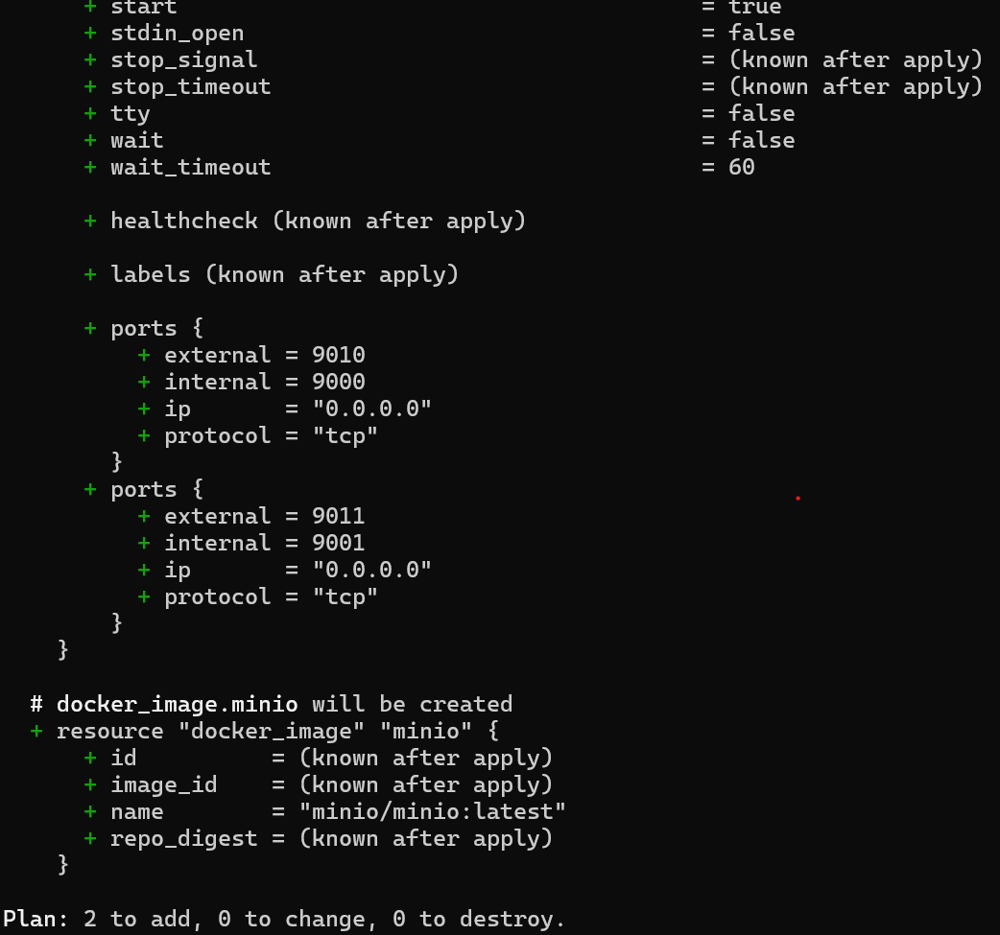
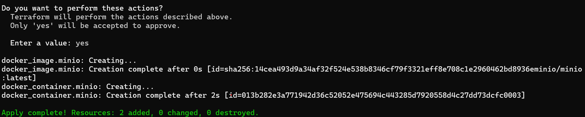
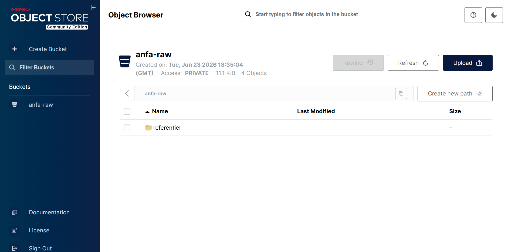
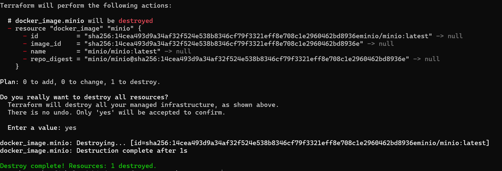

# Rendu Séance 4

**Nom et prénom :** KAMBIA Rafiatou
**Identifiant GitHub :** rafiatou-collab

## Résumé de la séance

J'ai installé Terraform, décrit une infrastructure Docker complète en HCL (réseau, volume, conteneur MinIO), maîtrisé le workflow init/plan/apply/destroy, compris le rôle du state Terraform et ses bonnes pratiques de versioning, et refactorisé le code avec des variables et un fichier .tfvars.

## Étapes principales

1. Installation de Terraform et premier `main.tf` minimal.
2. Maîtrise du workflow `init` -> `plan` -> `apply` -> `destroy`.
3. Compréhension du state Terraform et bonnes pratiques de versioning.
4. Stack complète : réseau, volume, conteneur MinIO.
5. Refactoring en variables et fichier `.tfvars`.

## Captures d'écran

### terraform plan (création initiale)


### terraform apply réussi


### Console MinIO créée par Terraform


### terraform destroy


## Réponses aux exercices d'application

### Exercice 1 - QCM conceptuel

**1.1 -> B** : L'IaC ne remplace pas la compréhension de l'infrastructure sous-jacente - elle la rend reproductible, mais il faut toujours comprendre ce qu'on décrit.

**1.2 -> B** : Le déclaratif décrit l'état souhaité ; l'impératif décrit la séquence d'actions à effectuer.

**1.3 -> B** : Une opération idempotente produit le même résultat quel que soit le nombre de fois où elle est appliquée - `terraform apply` deux fois de suite sans modification ne change rien.

**1.4 -> B** : Un provider est un plugin qui sait communiquer avec une API spécifique ; le provider kreuzwerker/docker sait parler à l'API Docker.

**1.5 -> B** : Terraform compare le state au code, ne voit aucun écart, et n'effectue aucune action - c'est l'idempotence observée en TP avec `No changes`.

**1.6 -> C** : terraform.tfstate mémorise ce que Terraform a créé pour pouvoir suivre les changements incrémentaux et calculer le delta entre l'état actuel et le code.

**1.7 -> B** : Le fichier peut contenir des secrets en clair (mots de passe, clés API) et peut être corrompu par des commits concurrents en équipe.

**1.8 -> C** : `terraform plan` affiche ce qui va changer sans rien modifier - c'est le réflexe fondamental avant tout apply.

**1.9 -> B** : OpenTofu est un fork open source de Terraform créé par la communauté après le changement de licence de HashiCorp en 2023.

**1.10 -> B** : Terraform provisionne l'infrastructure, Ansible configure des machines existantes - ils sont complémentaires.

### Exercice 2 - Lecture et interprétation d'un fichier Terraform

**2.1 - Les 4 resources :**
- docker_network "back" : crée un réseau Docker nommé anfa-backend pour connecter les conteneurs entre eux.
- docker_volume "data" : crée un volume Docker nommé postgres-data pour persister les données PostgreSQL.
- docker_image "postgres" : télécharge l'image Docker postgres:15 depuis Docker Hub.
- docker_container "db" : crée et lance le conteneur PostgreSQL avec ses variables d'environnement, ports, volume et réseau.

**2.2** : docker_image.postgres.image_id référence l'ID SHA256 réel de l'image après téléchargement, ce qui crée une dépendance explicite - Terraform s'assure que l'image est téléchargée avant de créer le conteneur. Écrire image = "postgres:15" directement casserait cette dépendance.

**2.3** : Terraform créera d'abord docker_network.back, docker_volume.data et docker_image.postgres en parallèle (pas de dépendances entre eux), puis docker_container.db en dernier car il référence les trois resources précédentes.

**2.4** : Le mot de passe secret123 est écrit en clair dans le code et sera versionné dans Git. Correction :
```hcl
variable "postgres_password" {
  description = "Mot de passe PostgreSQL"
  type        = string
  sensitive   = true
}
# Dans terraform.tfvars (ignoré par Git) :
# postgres_password = "secret123"
```

**2.5** : Terraform va recréer le conteneur car le mapping de ports n'est pas modifiable à chaud sur Docker. Le réseau et le volume ne seront pas touchés. Les données PostgreSQL dans le volume seront conservées car le volume est indépendant du conteneur.

### Exercice 3 - Diagnostic

**3.1 - La dépendance circulaire**

a. Terraform a détecté un cycle : container-a dépend de container-b et container-b dépend de container-a - il est impossible de déterminer lequel créer en premier.

b. Terraform construit un graphe de dépendances pour déterminer l'ordre de création ; un cycle rend ce graphe impossible à résoudre car il n'y a aucun point de départ valide.

c. Supprimer la référence circulaire en passant la valeur par une chaîne statique plutôt que par une référence à l'autre conteneur :
```hcl
resource "docker_container" "a" {
  name  = "container-a"
  image = "alpine"
  env   = ["LINKED_TO=container-b"]
}
resource "docker_container" "b" {
  name  = "container-b"
  image = "alpine"
  env   = ["LINKED_TO=container-a"]
}
```

**3.2 - Le plan qui veut tout recréer**

a. Les variables d'environnement d'un conteneur Docker ne sont pas modifiables à chaud - Docker ne permet pas de changer les env d'un conteneur existant sans le recréer, donc Terraform utilise -/+ plutôt que ~.

b. Non, les données ne sont pas perdues si elles sont dans un volume Docker - le volume est une resource indépendante du conteneur et n'est pas supprimé lors de la recréation.

c. Non, ce n'est pas gratuit : la recréation entraîne une interruption de service pendant quelques secondes, ce qui peut impacter les utilisateurs en production.

**3.3 - Le state corrompu**

a. Le fichier terraform.tfstate contient les secrets en clair - en le poussant sur GitHub, les mots de passe et clés API sont exposés publiquement.

b. Awa possède un state qui décrit une infrastructure qui tourne sur la machine de son collègue - si elle lance terraform apply, Terraform va tenter de modifier des resources qui n'existent pas sur sa machine, créant des conflits imprévisibles.

c. Utiliser un remote backend partagé (Terraform Cloud, bucket S3) pour stocker le state de manière centralisée, chiffrée et avec verrouillage.

### Exercice 4 - Adaptation Compose -> Terraform

```hcl
terraform {
  required_providers {
    docker = {
      source  = "kreuzwerker/docker"
      version = "~> 3.0"
    }
  }
}

provider "docker" {}

variable "minio_root_password" {
  description = "Mot de passe administrateur MinIO"
  type        = string
  sensitive   = true
}

resource "docker_network" "anfa_net" {
  name = "anfa-network"
}

resource "docker_volume" "minio_data" {
  name = "minio-data"
}

resource "docker_image" "minio" {
  name = "minio/minio:latest"
}

resource "docker_image" "jupyter" {
  name = "jupyter/scipy-notebook:latest"
}

resource "docker_container" "minio" {
  name    = "anfa-minio"
  image   = docker_image.minio.image_id
  command = ["server", "/data", "--console-address", ":9001"]
  restart = "unless-stopped"

  ports {
    internal = 9000
    external = 9000
  }
  ports {
    internal = 9001
    external = 9001
  }

  env = [
    "MINIO_ROOT_USER=anfa-admin",
    "MINIO_ROOT_PASSWORD=${var.minio_root_password}",
  ]

  volumes {
    volume_name    = docker_volume.minio_data.name
    container_path = "/data"
  }

  networks_advanced {
    name = docker_network.anfa_net.name
  }

  lifecycle {
    ignore_changes = [log_opts]
  }
}

resource "docker_container" "jupyter" {
  name    = "anfa-jupyter"
  image   = docker_image.jupyter.image_id
  restart = "unless-stopped"

  ports {
    internal = 8888
    external = 8888
  }

  env = [
    "JUPYTER_TOKEN=anfa-token",
  ]

  networks_advanced {
    name = docker_network.anfa_net.name
  }

  lifecycle {
    ignore_changes = [log_opts]
  }
}
```

### Exercice 5 - Mini-cas d'architecture

**5.1 - 4 types de resources Terraform :**
- Un bucket de stockage objet pour stocker les CSV du référentiel et les logs GPS bruts.
- Un cluster Kubernetes managé pour orchestrer les conteneurs Spark, Jupyter et Grafana avec élasticité.
- Un réseau privé virtuel (VPC) pour isoler les communications internes entre les services.
- Un registre d'images Docker privé pour héberger les images custom sans dépendre de Docker Hub.

**5.2** : Je recommande l'approche B (plusieurs fichiers séparés). Un fichier de 800 lignes est difficile à lire et à maintenir. Séparer par domaine (network.tf, storage.tf, compute.tf, monitoring.tf) permet à chaque membre de l'équipe de travailler sur sa partie sans conflits Git, et rend chaque fichier compréhensible indépendamment.

**5.3 - Deux mécanismes pour gérer dev et prod :**
- Fichiers .tfvars séparés : terraform.dev.tfvars et terraform.prod.tfvars appliqués avec `terraform apply -var-file=terraform.prod.tfvars`.
- Workspaces Terraform : `terraform workspace new dev` et `terraform workspace new prod` pour maintenir deux states indépendants avec le même code.

**5.4** : La migration ne sera pas triviale. Ce qui se transpose facilement : la logique de l'infrastructure reste identique en HCL, seuls les noms des providers changent. Ce qui demandera du travail : réécrire tous les fichiers .tf avec le provider AWS, reconfigurer les noms des services, migrer les données existantes et reconfigurer les accès et permissions. Le concept est portable, le code ne l'est pas directement.

**5.5 - 3 bonnes pratiques pour une équipe de 4 :**
- Stocker le state dans un remote backend partagé (Terraform Cloud ou bucket S3) avec verrouillage pour éviter les conflits et les fuites de secrets.
- Ne jamais committer terraform.tfvars - utiliser .gitignore et ne versionner que terraform.tfvars.example comme modèle.
- Toujours faire un terraform plan et le soumettre en code review avant un terraform apply en production.

## Difficultés rencontrées

- `terraform destroy` a échoué car un conteneur MinIO d'une séance précédente utilisait encore l'image. Résolution : `docker rm -f <id-conteneur>` puis relance de `terraform destroy`.
- `grep` n'est pas disponible en PowerShell - utilisation de `Select-String` à la place.
