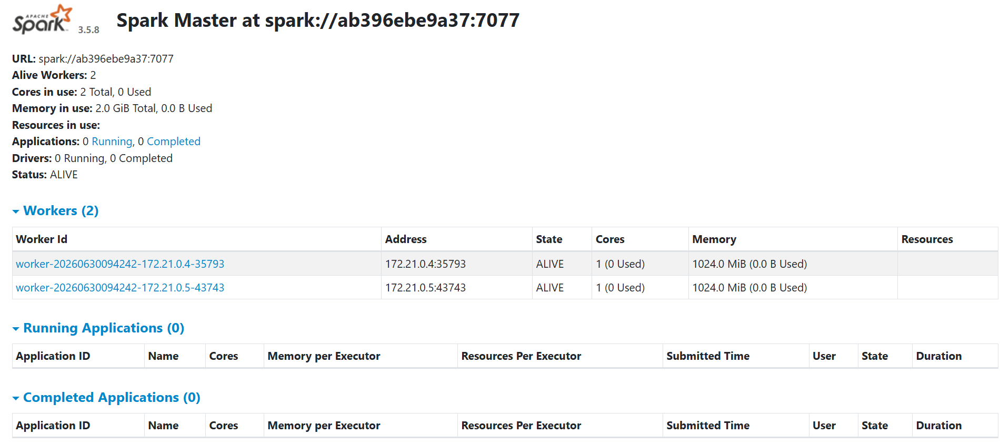
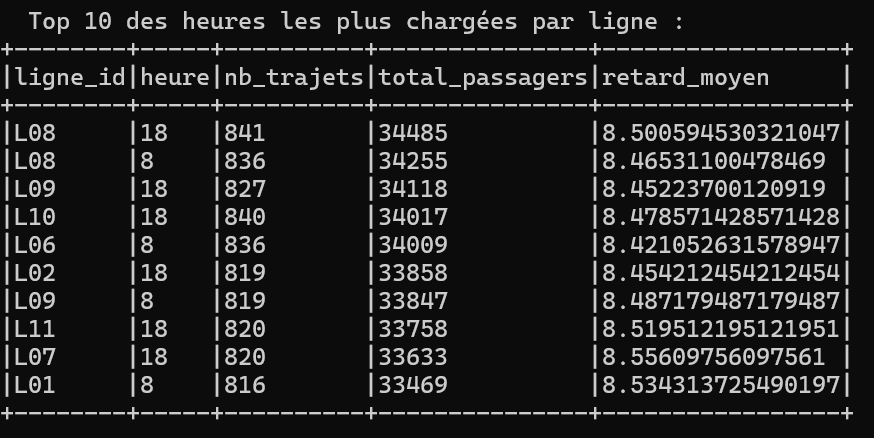
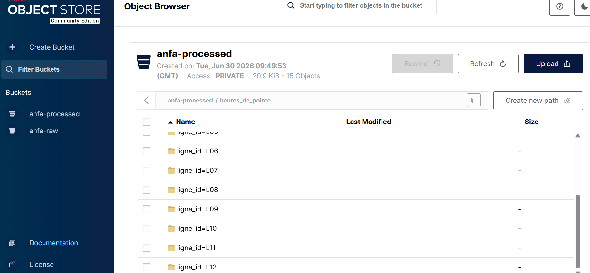

# Rendu Séance 5

**Nom et prénom :** KAMBIA Rafiatou

## Résumé de la séance

J'ai déployé un cluster Spark standalone (1 master + 2 workers) via Docker Compose, exécuté deux jobs PySpark distribués lisant les données depuis MinIO (référentiel Anfa et historique de trajets simulé), calculé des statistiques et écrit les résultats en Parquet dans MinIO, et observé le comportement du cluster via le dashboard Spark Master.

## Étapes principales

1. Déploiement du cluster Spark standalone (1 master + 2 workers) via Docker Compose.
2. Préparation de MinIO (buckets anfa-raw et anfa-processed) et upload du référentiel.
3. Premier job distribué (analyse_referentiel_cluster.py) : statistiques de base sur le référentiel.
4. Génération d'un historique simulé de trajets (~79 000 trajets) et job d'analyse des heures de pointe.
5. Comparaison subjective entre mode local et mode cluster.

## Captures d'écran

### Dashboard Spark Master avec 2 workers

### Application Spark exécutée avec succès

### Résultats du Top 10 dans la console

### Bucket anfa-processed avec heures_de_pointe partitionné

## Réflexion : local vs cluster

Sur le volume de données utilisé en TP (75 000 trajets, 4 petits CSV de référentiel), je n'ai pas observé de gain de performance flagrant avec le cluster par rapport au mode local de la séance 2 - les deux jobs se sont exécutés en quelques secondes à quelques dizaines de secondes. Cela confirme ce qui est expliqué dans le TP : sur un petit volume, l'overhead de communication entre le Driver et les Executors (sérialisation, réseau, coordination) coûte plus cher que ce que le parallélisme apporte.

L'intérêt du mode cluster devient évident dès qu'on dépasse les capacités RAM d'une seule machine, ou quand on a vraiment besoin de répartir le calcul sur plusieurs cœurs/machines pour un volume de données massif (des millions à centaines de millions de lignes). Pour un usage quotidien sur de petits jeux de données, je privilégierais le mode local pour sa simplicité et sa rapidité de mise en route. Pour un vrai pipeline de production avec des données GPS de plusieurs Go par jour, le mode cluster (ou Kubernetes) devient indispensable.

## Bonus Spark sur Kubernetes

Non réalisé.

## Difficultés rencontrées

Le job heures_de_pointe.py a échoué une première fois avec une erreur PATH_NOT_FOUND alors que le fichier trajets_30j.csv existait bien dans MinIO (vérifié via mc ls). Une simple relance du spark-submit a résolu le problème, probablement lié à un léger délai de propagation de l'écriture S3A ou un cache du premier essai.
