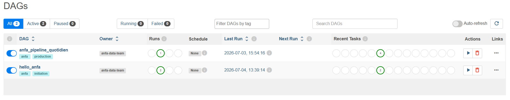
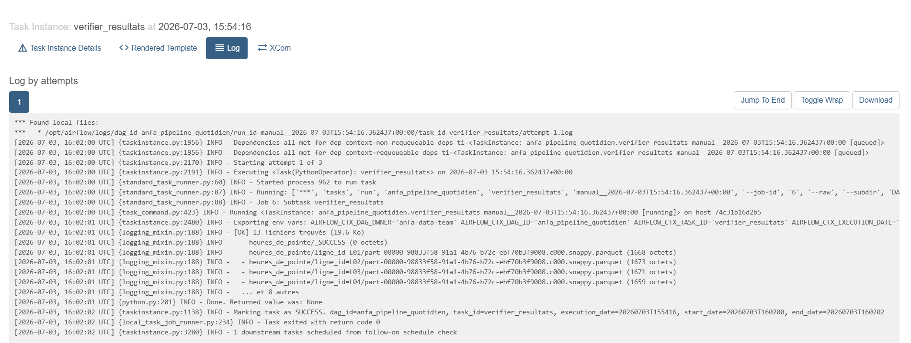
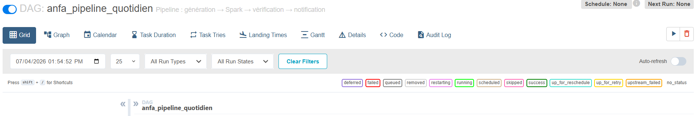

# Rendu Séance 6

**Nom et prénom :** KAMBIA Rafiatou
**Identifiant GitHub :** rafiatou-collab

## Résumé de la séance

J'ai déployé Apache Airflow via Docker Compose avec MinIO et Spark, écrit et exécuté un premier DAG simple (hello_anfa) à 2 tâches, puis orchestré un pipeline métier complet (anfa_pipeline_quotidien) à 4 tâches automatisant la génération de trajets, l'analyse Spark des heures de pointe, la vérification des résultats et la notification. J'ai aussi observé le comportement des retries en cassant volontairement une tâche.

## Étapes principales

1. Déploiement de la stack Airflow + MinIO + Spark via Docker Compose.
2. Préparation de MinIO (buckets anfa-raw et anfa-processed, clé applicative).
3. Premier DAG hello_anfa : 2 tâches en séquence, déclenchement manuel, observation des logs.
4. DAG métier anfa_pipeline_quotidien : 4 tâches orchestrant génération, analyse Spark, vérification et notification.
5. Démonstration des retries : tâche cassée volontairement, observation du comportement failed/upstream_failed, réparation et rejeu.

## Captures d'écran

### Page d'accueil Airflow

### DAG hello_anfa exécuté avec succès

### Pipeline Anfa complet en succès

### Logs de la tâche verifier_resultats

### Tâche en échec et retry

## Réflexion sur l'orchestration

Airflow apporte une valeur majeure par rapport à l'exécution manuelle des jobs Spark : la planification automatique, la gestion des dépendances entre tâches, la visibilité via l'UI (Graph view, logs par tâche), et la gestion des erreurs avec retries automatiques. En séance 5, on lançait spark-submit à la main - avec Airflow, ce même job s'exécute automatiquement, dans le bon ordre, avec journalisation et possibilité de rejouer uniquement la tâche en échec sans tout relancer depuis le début.

## Difficultés rencontrées

- L'image postgres:18-alpine était incompatible avec la configuration du compose (changement de structure des répertoires en version 18). Résolution : remplacement par postgres:15-alpine.
- L'UI Airflow sur http://localhost:8088 n'était pas accessible après le premier démarrage. Résolution : docker restart anfa-airflow-webserver.
