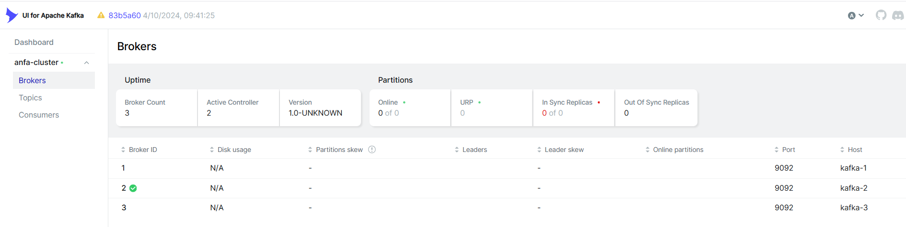
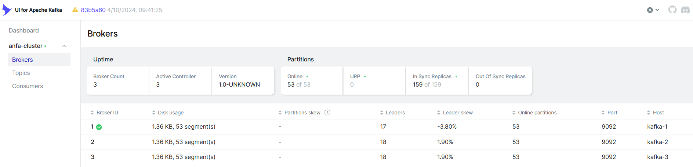
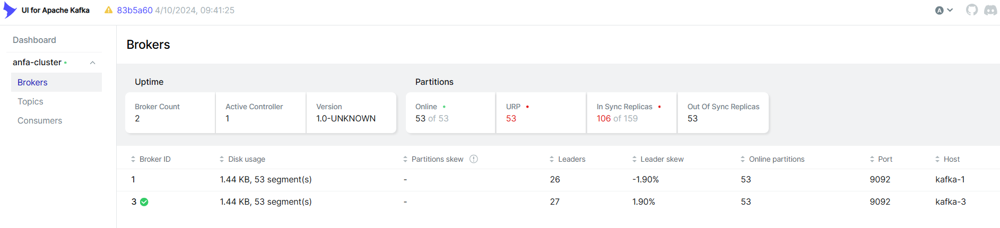
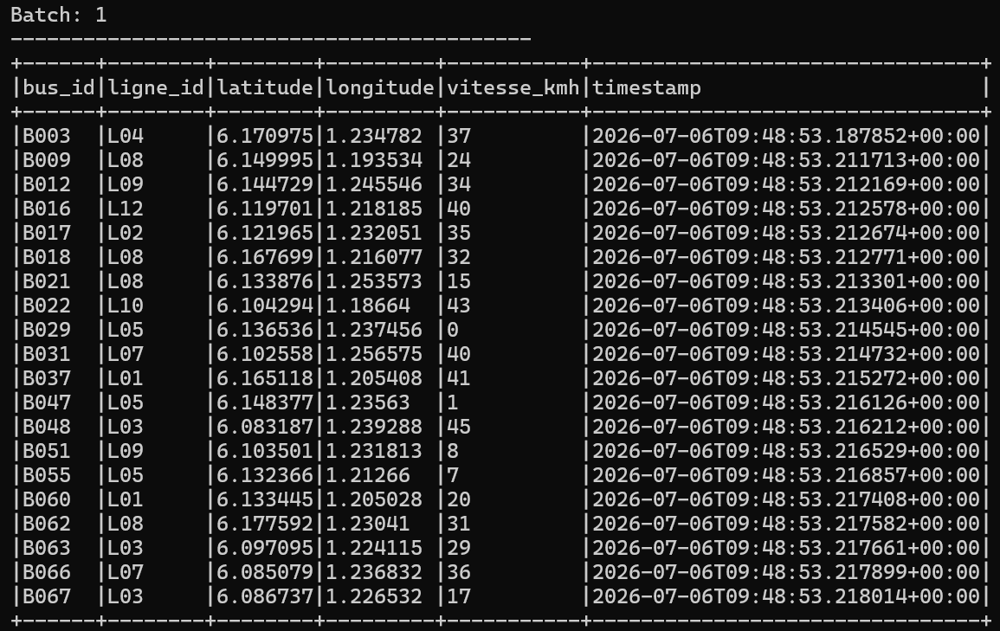

# Rendu — Séance 7

**Nom et prénom :** <Votre nom complet>
**Identifiant GitHub :** <votre-username>
**Date de soumission :** <JJ/MM/AAAA>

## Résumé de la séance

<2-4 lignes : cluster Kafka 3 brokers déployé, flotte de bus simulée en flux continu,
tolérance aux pannes observée, Spark Structured Streaming consommant et agrégeant le flux vers MinIO.>

## Étapes principales

1. Déploiement du cluster Kafka (3 brokers, mode KRaft) + Kafka UI.
2. Création du topic `anfa-positions-bus` (3 partitions, réplication 3).
3. Premier producer/consumer Python pour comprendre la mécanique.
4. Simulation de 100 bus envoyant leur position en continu.
5. Démonstration de tolérance aux pannes (arrêt d'un broker).
6. Spark Structured Streaming : lecture console, puis agrégation en fenêtre vers MinIO.

## Captures d'écran

### 3 brokers actifs dans Kafka UI

### Débit de messages en augmentation

### Cluster avec 2 brokers sur 3 (après arrêt volontaire)

### Micro-batchs affichés en console par Spark

### Résultats agrégés dans MinIO

## Réflexion personnelle

<3-5 lignes : dans quel cas utiliseriez-vous Kafka + Spark Streaming plutôt que le pipeline batch
Airflow + Spark vu en séance 5-6 ? Qu'est-ce que la réplication à 3 brokers vous a concrètement montré ?>

## Réponses aux exercices d'application

<À compléter d'après les énoncés fournis avec l'assignment.>

## Difficultés rencontrées

<Aucune | Décrivez brièvement.>
