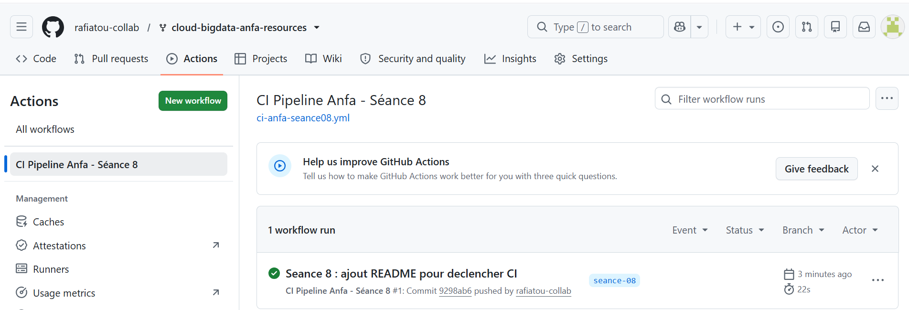
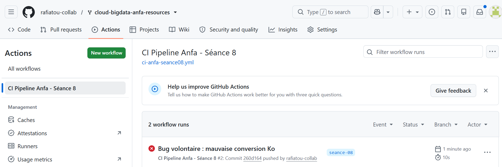

# Rendu Séance 8

**Nom et prénom :** KAMBIA Rafiatou
**Identifiant GitHub :** rafiatou-collab

## Résumé de la séance

J'ai séparé la logique métier du DAG Airflow dans un module Python testable indépendamment (anfa_logic.py), écrit des tests unitaires avec pytest, et mis en place un workflow GitHub Actions qui exécute automatiquement lint (flake8) et tests (pytest) à chaque push sur la branche seance-08. J'ai observé le pipeline réussir puis bloquer un déploiement après l'introduction d'un bug volontaire.

## Étapes principales

1. Synchronisation du fork et création de la branche seance-08.
2. Lecture du module anfa_logic.py et du fichier de tests test_anfa_logic.py.
3. Exécution des tests localement avec pytest (5 tests verts).
4. Push sur GitHub déclenchant automatiquement le workflow CI.
5. Observation du pipeline vert (valider-dag + deployer réussis).
6. Introduction d'un bug volontaire (1000 au lieu de 1024) et observation de l'échec du pipeline.

## Captures d'écran

### Workflow CI réussi

### Workflow CI en échec après bug volontaire

## Réflexion

Le CI/CD apporte une discipline essentielle : aucun code défaillant ne peut atteindre la production sans être détecté automatiquement. Sans ce pipeline, un bug comme la mauvaise conversion Ko (1000 au lieu de 1024) passerait inaperçu jusqu'en production. Avec GitHub Actions, le problème est détecté immédiatement après le push, avant tout déploiement. La séparation de la logique métier dans un module indépendant (anfa_logic.py) est aussi une bonne pratique : elle permet de tester sans installer Airflow, ce qui rend la CI plus rapide et plus légère.

## Difficultés rencontrées

Le workflow ne se déclenchait pas après le premier push car seance-08/ ne contenait aucun fichier modifié par rapport au merge upstream. Résolution : ajout d'un fichier README.md dans seance-08/ pour forcer le déclenchement du pipeline.
