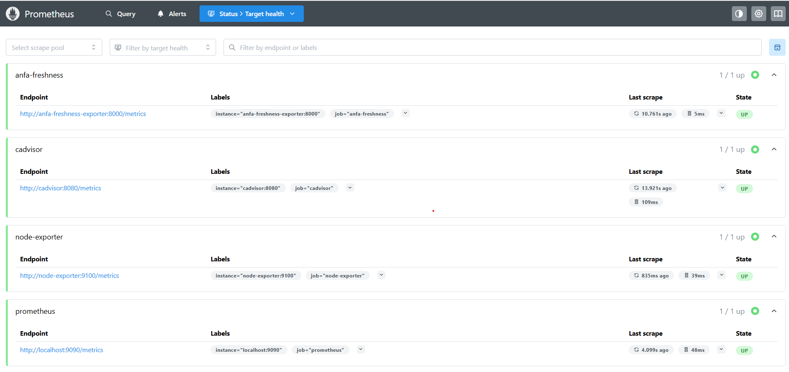
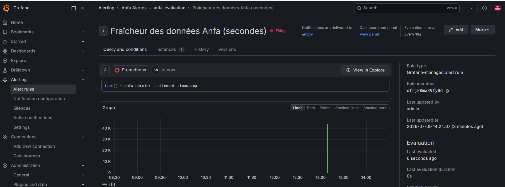

# Rendu Séance 9

**Nom et prénom :** KAMBIA Rafiatou
**Identifiant GitHub :** rafiatou-collab

## Résumé de la séance

J'ai déployé une stack de monitoring complète (Prometheus + Grafana + Node Exporter + cAdvisor + exportateur de fraîcheur Anfa), exploré les cibles scrapées par Prometheus, exécuté des requêtes PromQL, importé un dashboard Node Exporter Full dans Grafana, construit un panneau de fraîcheur métier avec jauge et seuils, configuré une règle d'alerte, et simulé une panne pour observer l'alerte passer de Normal à Firing puis revenir à Normal.

## Étapes principales

1. Déploiement de la stack monitoring via Docker Compose (5 services).
2. Vérification des 4 cibles Prometheus toutes UP (prometheus, node-exporter, cadvisor, anfa-freshness).
3. Requête PromQL time() - anfa_dernier_traitement_timestamp : graphique en dents de scie.
4. Import du dashboard Node Exporter Full (ID 1860) dans Grafana.
5. Création du panneau Fraîcheur des données Anfa avec jauge et seuils (vert/orange/rouge).
6. Configuration d'une règle d'alerte (seuil 90s, evaluation 10s, for 30s).
7. Simulation de panne via docker exec touch /tmp/anfa_en_panne : alerte Firing observée.
8. Réparation via docker exec rm /tmp/anfa_en_panne : alerte revenue à Normal.

## Captures d'écran

### Prometheus - 4 cibles UP

### Grafana - Dashboard Node Exporter Full

### Grafana - Alerte en état Firing

## Réflexion

Cette séance illustre parfaitement la limite du monitoring purement infrastructurel : tous les conteneurs peuvent être "Up" et tous les pods "Running" pendant qu'un pipeline cesse silencieusement de produire des résultats frais. La métrique de fraîcheur time() - anfa_dernier_traitement_timestamp est une métrique métier - elle mesure non pas si le système tourne, mais s'il produit ce qu'on attend de lui. C'est exactement la situation d'Awa dans le CM : sans cette métrique, la panne aurait pu passer inaperçue pendant des heures. Prometheus et Grafana permettent de passer d'un monitoring "le serveur tourne" à un monitoring "le pipeline produit des données fraîches", ce qui est la vraie question en production.

## Difficultés rencontrées

La source de données Prometheus n'apparaissait pas dans la liste lors de l'import du dashboard 1860. Résolution : ajout manuel de la source via Connections -> Data sources -> Add data source avec l'URL http://prometheus:9090.
