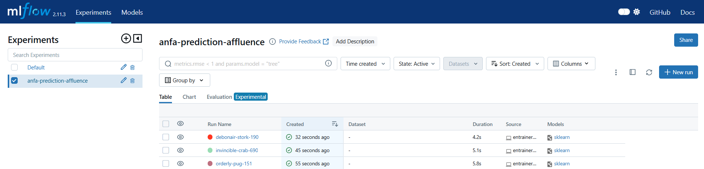
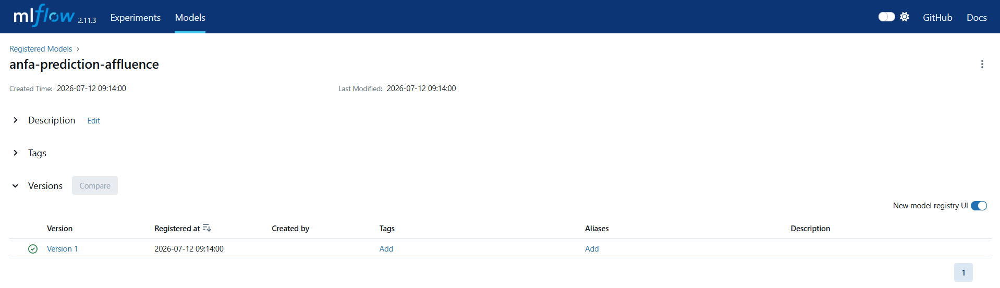

# Rendu Séance 10

**Nom et prénom :** KAMBIA Rafiatou
**Identifiant GitHub :** rafiatou-collab

## Résumé de la séance

J'ai déployé un serveur MLflow Tracking via Docker Compose, généré un dataset d'affluence Anfa, entraîné 3 versions d'un modèle RandomForest avec des hyperparamètres différents en traçant chaque run, comparé les runs dans l'UI MLflow, enregistré le meilleur modèle (n_estimators=100, max_depth=8, R²~0.97) dans le Model Registry en statut Production, et rédigé une fiche de conformité pour l'application mobile Anfa.

## Étapes principales

1. Déploiement du serveur MLflow (SQLite + artefacts locaux) via Docker Compose.
2. Génération du dataset dataset_affluence.csv (~3240 lignes).
3. Entraînement de 3 runs avec hyperparamètres différents (50/5, 100/8, 20/3).
4. Comparaison des runs dans l'UI MLflow : meilleur R² pour n_estimators=100, max_depth=8.
5. Enregistrement du meilleur modèle dans le Model Registry, passage en statut Production.
6. Rédaction de la fiche de conformité pour l'application mobile Anfa.

## Captures d'écran

### MLflow - Tableau des 3 runs

### MLflow - Modèle en statut Production

## Réflexion

MLflow résout le problème de Kossi décrit en CM : sans outil de tracking, chaque expérimentation est perdue dans des notebooks dispersés nommés test_v2_final.ipynb, les hyperparamètres oubliés, les performances non comparées. Avec MLflow, chaque run est automatiquement tracé, daté, comparable et reproductible. Le Model Registry ajoute une couche de gouvernance : n'importe quel script peut charger "la version en Production" sans connaître son numéro de run, et la promotion d'une nouvelle version ne nécessite aucune modification du code applicatif.

## Réflexion sur la fiche de conformité

La gouvernance des données n'est pas qu'une contrainte légale - c'est une nécessité technique et éthique. Les données GPS et de paiement des passagers d'Anfa sont particulièrement sensibles car leur combinaison permet de reconstituer les habitudes de vie des personnes. La loi togolaise n°2019-014 impose un cadre clair que tout projet data doit respecter dès la conception (privacy by design), pas en correction après coup.

## Difficultés rencontrées

Impossibilité d'installer mlflow directement sur la machine hôte Windows (conflits numpy/compilateur C absent). Résolution : exécution des scripts directement dans le conteneur anfa-mlflow via docker exec.
